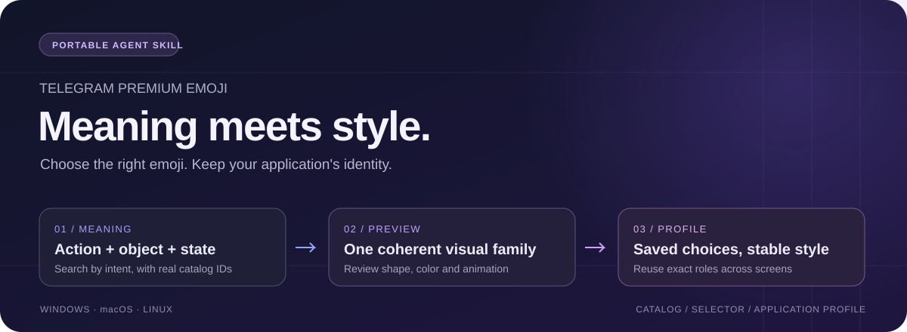

<div align="center">



# Telegram Premium Emoji

**Правильный эмодзи по смыслу. Единый стиль во всём приложении.**

[](https://zulut30.github.io/premium-telegram-emoji/)
[](https://github.com/Zulut30/premium-telegram-emoji/actions/workflows/ci.yml)
[](https://www.python.org/)
[](https://agentskills.io/specification)

[Каталог](https://zulut30.github.io/premium-telegram-emoji/) · [Установка](docs/installation.md) · [Подбор и стиль](references/emoji-selection.md) · [Скачать скилл](https://github.com/Zulut30/premium-telegram-emoji/releases/latest) · [English](README.en.md)

</div>

## Каталог, скилл и бот

Проект помогает находить реальные Telegram `custom_emoji_id`, выбирать подходящие
символы для интерфейса и сохранять выбор при развитии приложения.

| | Возможности |
| --- | --- |
| **Каталог** | 7 092 уникальных ID, 68 разделов, 13 стилевых семейств; превью, поиск на русском и английском, оценки и экспорт профиля |
| **Скилл для агента** | Подбор по действию и состоянию, визуальная проверка, один основной пак, закреплённые роли в `emoji-style.json` |
| **Инструмент подбора** | JSON с точными ID, HTML и доказательствами совпадения; офлайн-поиск и проверка профиля через Python |
| **Бот пополнения** | Принимает эмодзи с описанием, добавляет их в каталог и публикует изменения через GitHub Actions |

**Windows · macOS · Linux** — один пакет. Для Codex, Claude Code, Cursor,
GitHub Copilot, OpenCode и других агентов с поддержкой
[Agent Skills](https://agentskills.io/specification).

## Установить за минуту

Для скилла нужны **Git и Python 3.11+**. Дополнительные Python-пакеты, токен бота
и ключ модели для подбора не требуются.

```bash
git clone https://github.com/Zulut30/premium-telegram-emoji.git
cd premium-telegram-emoji
python3 install_skill.py --agent codex
```

На **Windows / PowerShell** последняя команда:

```powershell
py -3 install_skill.py --agent codex
```

Выбери своего агента:

| Агент | Установка |
| --- | --- |
| Codex | `python3 install_skill.py --agent codex` |
| Claude Code | `python3 install_skill.py --agent claude` |
| Cursor | `python3 install_skill.py --agent cursor` |
| GitHub Copilot | `python3 install_skill.py --agent copilot` |
| OpenCode | `python3 install_skill.py --agent opencode` |
| Другой совместимый агент | `python3 install_skill.py --agent universal` |

Используй доступный интерпретатор: `python3`, `python` или `py -3`.
Установщик напечатает точный путь. Открой новую сессию агента.
Для установки в приложение добавь `--scope project --project "/path/to/app"`.

**Без Git:** скачай ZIP из [релиза](https://github.com/Zulut30/premium-telegram-emoji/releases/latest),
распакуй и запусти находящийся внутри `install_skill.py`.

[Полное руководство →](docs/installation.md) — пути для всех агентов, Windows,
проектная установка, ручной импорт, обновление и установка других скиллов.

## Просто попроси агента

```text
Используй telegram-premium-emoji. Подбери эмодзи для настроек, поиска,
уведомлений и оплаты. Нужен единый минималистичный стиль.
Проверь превью, сохрани выбор в emoji-style.json приложения и примени в коде.
```

В Codex можно написать `$telegram-premium-emoji`, в Claude Code —
`/telegram-premium-emoji`, в Cursor — выбрать скилл из меню `/`.

Следующие задачи продолжают тот же стиль:

```text
Добавь экран подписки. Используй существующий emoji-style.json:
сохрани выбранный пак и уже закреплённые ID, подбери недостающие роли.
```

Агент читает профиль приложения, уточняет назначение каждого символа и получает
короткий список кандидатов. Затем проверяет реальные изображения и сохраняет
точные ID. Обновление каталога не заменяет принятые решения.

## Что делает подбор надёжнее

- **Действие и предмет:** «удалить файл» ищет удаление; файл служит контекстом.
- **Разные состояния:** включённые и отключённые уведомления получают разные роли.
- **Ограничения:** статичность, одноцветность и возможность перекрашивания проверяются по метаданным.
- **Проверенный выбор:** `--bind ROLE=ID` закрепляет конкретный вариант после просмотра превью.
- **Стабильный стиль:** один основной пак; дополнительные источники записываются осознанно.
- **Честные пробелы:** слабое совпадение по категории или неизвестное изображение не заполняет роль автоматически.
- **Составные эмодзи:** рамки, кнопки и надписи сохраняют порядок частей и повторяющиеся ID.

Скилл переносим между агентами: профиль хранится **в приложении** и содержит
роли, паки, ограничения и строковые ID. Подбор использует правила и проверенные
метаданные; агент интерпретирует задачу и оценивает превью. Полный процесс требует
доступа к файлам и Python; просмотр изображений — доступа к сети.

[Руководство по подбору →](references/emoji-selection.md) · [Инструкции скилла →](SKILL.md)

<details>
<summary><strong>CLI: поиск, состояния и сохранённый профиль</strong></summary>

Команды ниже запускаются из папки скилла или репозитория. Для профиля укажи
абсолютный путь к приложению.

```bash
python3 scripts/select_emoji.py styles
python3 scripts/select_emoji.py search "колокольчик без звука" --style minimal
python3 scripts/select_emoji.py search "Майнкрафт" --pack GameIcons
python3 scripts/select_emoji.py search "начать игру" --pack sfsymbols
python3 scripts/select_emoji.py search "уведомления" --animation static --color monochrome
python3 scripts/select_emoji.py search "уведомления" --profile "/path/to/app/emoji-style.json"
```

```bash
python3 scripts/select_emoji.py palette --style minimal --pack sfsymbols --roles notifications_on notifications_muted --role-query "notifications_on=включить уведомления" --role-query "notifications_muted=колокольчик без звука" --profile "/path/to/app/emoji-style.json" --save
python3 scripts/select_emoji.py validate "/path/to/app/emoji-style.json"
python3 scripts/select_emoji.py compositions "ПОЛЕЗНОЕ" --pack nexus_base
```

В Telegram используй полученный HTML с `parse_mode="HTML"`; в веб-интерфейсе —
`preview_url` как изображение. Тег `<tg-emoji>` предназначен для сообщений Telegram.

</details>

## Посмотреть каталог

Для игровых ботов поддерживаются 13 ролей: от инвентаря и достижений до здоровья,
валюты и заданий. Названия игр распознаются на русском и английском, включая
`CS2` и `WoW`. [Примеры игровых палитр →](references/emoji-selection.md#gaming-bots)

**[Открыть онлайн-каталог →](https://zulut30.github.io/premium-telegram-emoji/)**

Поиск по названию, смыслу, ключу и ID; фильтры по паку и стилю; реальные превью;
копирование ID и HTML; личные оценки. Выбранный стиль и пак сохраняются в браузере,
а профиль можно экспортировать для агента.

| Данные | Ссылка |
| --- | --- |
| Полный машиночитаемый индекс | [emoji-index.json](https://zulut30.github.io/premium-telegram-emoji/emoji-index.json) |
| Каталог с точными ID | [emoji-catalog.md](references/emoji-catalog.md) |
| Названия, категории и визуальные метаданные | [emoji-packs.json](data/emoji-packs.json) |
| Разбор паков | [pack-analysis.md](references/pack-analysis.md) |
| 33 примера составных изображений | [emoji-compositions.md](references/emoji-compositions.md) |

## Пополнить каталог

Отправь боту сообщение вида `[premium emoji] Описание на русском`, затем выбери
раздел или создай новый. Бот извлечёт реальный ID, сохранит запись и отправит
изменения в GitHub. Actions соберёт и опубликует сайт.

Скилл работает независимо от бота. Инструкции по запуску, импорту новых паков и
проверкам проекта находятся в [руководстве разработчика](docs/development.md).

## Как устроен проект

```text
SKILL.md + scripts/select_emoji.py → кандидаты → просмотр превью → emoji-style.json
                                  ↳ точные ID и роли в коде приложения

Telegram → bot.py → каталог и метаданные → GitHub Actions → GitHub Pages
                                        ↳ переносимый ZIP / .skill
```

```text
SKILL.md                 Инструкции для агента
install_skill.py         Установка и обновление на трёх ОС
scripts/select_emoji.py  Переносимая точка входа
premium_emoji/           Ядро: каталог, смысл, ранжирование и профили
integrations/            Telegram, Git и сборка сайта
scripts/project.py       Единая команда проверки проекта
emoji_catalog.py         Совместимый импорт общего загрузчика
emoji_selection.py       Совместимый импорт подбора
references/             Каталог и руководства
data/                   Проверенные метаданные и политика подбора
web/                     Исходники сайта
bot.py                   Пополнение через Telegram
.github/workflows/ci.yml Проверки → пакет / сайт / релиз
```

[Карта архитектуры](docs/architecture.md) объясняет зависимости и места для изменений.
[Правила для агентов](AGENTS.md) задают границы модулей и обязательную проверку:
`python scripts/project.py check --web`.

CI проверяет данные, бота, установку, подбор и интерфейс на Windows, macOS и Linux. ZIP и `.skill`
собираются из явного списка файлов, с проверкой SHA-256; токены, логи и рабочее
окружение в пакет не входят. Проверки: [GitHub Actions](https://github.com/Zulut30/premium-telegram-emoji/actions).

## Добавить свои эмодзи

Используй бота или предложи PR с каталогом и проверенными метаданными.
Для целого пака сначала просмотри изображения и подпиши их; затем выполни импорт.
[Процесс импорта и проверки →](docs/development.md#import-packs)

<div align="center">

**Хороший символ передаёт смысл. Хороший набор сохраняет стиль.**

[Каталог](https://zulut30.github.io/premium-telegram-emoji/) · [Установить](docs/installation.md) · [English](README.en.md)

</div>
