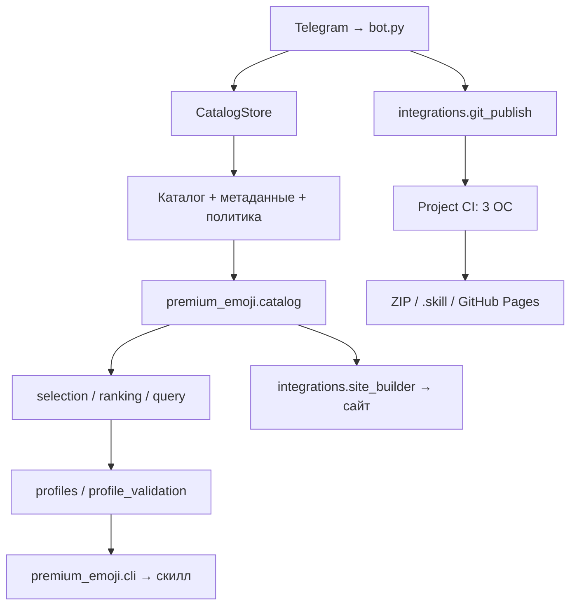

# Архитектура проекта

[← README](../README.md) · [Разработка и проверки](development.md)

Проект состоит из общего ядра и адаптеров. Скилл, CLI и сайт используют одну
политику подбора. Бот пополняет исходные файлы, а CI проверяет их и выпускает
сайт и переносимый скилл.



Стрелки показывают поток данных. В коде адаптеры импортируют ядро; ядро
не импортирует адаптеры, SDK бота или конфигурацию с токенами. Это ограничение
проверяется тестом. Python CLI работает без внешних библиотек и сети, включая
поиск из распакованного пакета в другой рабочей папке.

## Модули и места для изменений

| Задача | Файл или модуль |
| --- | --- |
| Пути относительно репозитория или установленного скилла | `premium_emoji/paths.py` |
| Чтение каталога, объединение алиасов, общий индекс | `premium_emoji/catalog.py` |
| Синонимы, стили и признаки состояния | `data/selection-policy.json` |
| Разбор запроса и отрицаний | `premium_emoji/query.py` |
| Ограничения, оценка кандидата и объяснение | `premium_emoji/ranking.py` |
| Поиск и составные изображения | `premium_emoji/selection.py` |
| Палитра приложения и повторное использование выбранных ID | `premium_emoji/profiles.py` |
| Проверка закреплённых ролей, состояний и ограничений | `premium_emoji/profile_validation.py` |
| JSON CLI | `premium_emoji/cli.py` |
| HTML для Telegram и Unicode fallback | `premium_emoji/rendering.py` |
| Запись JSON, подготовка файлов и откат | `premium_emoji/io.py` |
| Редактирование Markdown и списка ID | `premium_emoji/catalog_store.py` |
| UTF-16 entities из Telegram | `premium_emoji/telegram_entities.py` |
| Обработка сообщений и FSM | `bot.py` |
| Публикация каталога в Git | `integrations/git_publish.py` |
| Загрузка превью с явно переданным токеном | `integrations/telegram_previews.py` |
| HTML и два выходных файла сайта | `integrations/site_builder.py` |
| Запуск сборки сайта | `generate_site.py` |
| Визуальная подготовка и импорт паков | `tools/inspect_*`, `tools/review_pack_batch.py`, `tools/import_*` |
| Проверка согласованности источников | `premium_emoji/validation.py` |
| Все проверки разработки и CI | `scripts/project.py` |
| Состав переносимого пакета и установка | `tools/skill_package.py`, `install_skill.py` |

Модули `emoji_catalog.py` и `emoji_selection.py` в корне сохраняют прежние
импорты. `scripts/select_emoji.py` и `tools/select_emoji.py` запускают один CLI.
Из корня также доступно `python -m premium_emoji`. Эти входы сохраняются при
изменениях внутренней структуры.

## Источники и контракты

`references/emoji-catalog.md` содержит строки каталога и разделы.
`emoji-ids.txt` — совместимый список ID для пополнения через бота.
`data/emoji-packs.json` дополняет записи проверенными названиями, категориями,
стилем, анимацией, доступностью и признаками визуальной проверки.
`data/emoji-compositions.json` задаёт порядок частей, включая повторения.
`data/selection-policy.json` содержит общие правила Python и браузерного поиска.

У роли может быть отдельный `source_pattern`: запрос «инвентарь» сопоставляется
с проверенным названием «Рюкзак», а не с названием пака. `query_overrides`
уточняет широкое понятие: «геймпад» заменяет общий смысл «игры».
`preferred_source_pattern` повышает подходящий символ внутри допустимых вариантов.
Игровые алиасы извлекаются целиком до разбора состояний: `Counter-Strike`
не создаёт признак счётчика. В режиме темы нужен подтверждённый игровой образ;
в запросе действия название игры служит контекстом и допускает обычный UI-значок.
Изменение правил обновляет версию каталога, сохраняя ранее проверенные привязки.

`catalog_data()` создаёт общий индекс: уникальные строковые ID, алиасы и
принадлежность разделам, семантические признаки и `catalog_version`.
Одна подготовленная структура используется для HTML и `emoji-index.json`.
Версия определяется содержимым и политикой; перенос модулей её не меняет.

Профиль приложения `emoji-style.json` остаётся документом схемы 1. Он хранит
роли, запросы состояний, выбранные ID, основной/дополнительные паки и ограничения.
Подбор повторно использует проверенные привязки; новое ранжирование не заменяет
их автоматически. Запись профиля проходит проверку и заменяет файл целиком.

## Запись и публикация

`CatalogStore.save()` подготавливает оба файла перед изменением, проверяет,
что исходники не изменились, и выполняет замену. При обычной ошибке записи
восстанавливает заменённые файлы. Если файловая система мешает самому откату,
исходная резервная копия сохраняется, а её путь попадает в ошибку для восстановления.
Это защита от ошибок записи, а не транзакция базы данных при аварийном отключении.

В процессе бота один `RLock` сериализует запись и Git. Обработчик принимает
снимок запроса, освобождает его FSM и запускает запись/публикацию через
`asyncio.to_thread`. Медленный push не блокирует event loop и запросы других
пользователей. Позднее завершение записи не очищает новый запрос пользователя.
Должна работать одна polling-копия бота; блокировка не охватывает другие процессы
или внешние редакторы, поэтому перед записью также сверяются исходные байты.

Git коммитит только два пути каталога через `commit --only`. Сторонние staged
изменения остаются в индексе. Ошибка push сохраняет локальные файлы и коммит;
пользователь получает отдельный статус публикации.

## Проверки и выпуск

```bash
python scripts/project.py check --web
```

Порядок: проверка данных → все Python-тесты → офлайн-сборка сайта → DOM →
согласованность ранжирования Python/JS. Python для JS-проверки берётся из того же
окружения, которое запустило команду. Зависимости DOM фиксируются в lock-файле.

Один workflow `Project CI` выполняет этот набор на трёх ОС. После успешной
матрицы собирается переносимый пакет; `main` публикует сайт, теги `skill-v*`
публикуют релиз. Токен передаётся только шагу загрузки превью. Неудачная проверка
блокирует все три вида публикации.

Пакет включает только разрешённые файлы общего ядра, CLI, инструкции и данные.
Он не включает SDK, редактор каталога, адаптеры бота, Node.js или конфигурацию.
При добавлении runtime-модуля обновляй allowlist и проверяй реальную установку
распакованного архива; приложение должно сохранять свой профиль при обновлении.
